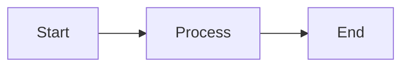

# Support Assistant – Concept Pack (Markdown)

This file contains everything you need for your meeting:
- **Mermaid render test** (to confirm GitHub can render Mermaid in your environment)
- **Agent Flow Diagram – Support Assistant** (Mermaid, compatibility-safe)
- **Teams-style UI Wireframe** (text-only, Teams look & feel)
- **Presenter Notes** (talk track)

---

## How to view this file on GitHub
1. Save as `agent-support-concept.md` (already done here).
2. Commit & push to your GitHub repository.
3. Open the file in GitHub and use **Preview** (not "Raw").
4. If the diagram still doesn't render, try an **Incognito/Private** window (to avoid ad‑blockers) or paste the diagram section into **https://mermaid.live** to export PNG/SVG.

> Tip: If your organization uses **GitHub Enterprise Server** and Mermaid doesn't render, include the exported **PNG** in your README as a fallback.

---

## 1) Mermaid Render Test (should render)



If this test does **not** render, the problem is environmental (browser extensions/JS or GitHub version), not the code.

---

## 2) Agent Flow Diagram – Support Assistant (compatibility-safe)

> Labels in **English**. Newlines inside nodes use `<br/>`. Symbols like `>=` are used instead of special glyphs.

```mermaid
flowchart LR

  %% ---------- SWIMLANES ----------
  subgraph U[User]
    A[User input:<br/>- Free text question<br/>- Ticket ID (e.g., #12345)]
  end

  subgraph AG[Copilot Agent (Logic)]
    E[Guardrails & Pre-processing<br/>PII redaction · Language detection · Normalization]
    B[Intent & entity detection<br/>Classify intent (search/triage)<br/>Extract entities (ticket ID, product, error)]
    C{Contains valid ticket ID?}
    D[Query builder<br/>Build Jira JQL / Confluence query<br/>Expand with synonyms & product taxonomy]
    G[Fetch from Jira<br/>getIssue / search similar issues<br/>pull status, resolution, owner]
    H[Fetch from Confluence<br/>search pages / labels<br/>retrieve excerpts]
    I[Retrieval & ranking<br/>Hybrid search (BM25 + embeddings)<br/>Deduplicate & score by relevance]
    J[Answer synthesis<br/>Summarize findings · Cite Jira issues & Confluence pages<br/>Generate next best actions]
    K{Confidence >= threshold?}
    L[Clarifying question<br/>Ask for missing details<br/>Offer disambiguation options]
    M[Action suggestions<br/>Open Jira issue · Open Confluence article<br/>Add comment · Create sub-task / link KB]
    N[Feedback & learning<br/>Thumbs up/down · Capture chosen action<br/>Improve ranking signals]
    O{Escalation needed?}
    P[Human hand-off<br/>Assign to support queue<br/>Create escalation note · Attach conversation context]
    Q[End]
  end

  subgraph INT[Integrations & Data]
    UAUTH[(Auth: SSO / OAuth)]
    R[(Jira API)]
    S[(Confluence API)]
    T[(Vector / Index store)]
  end

  subgraph GOV[Governance & Ops]
    X[Policy & rate limiting]
    Y[Error handling & retries]
    V[Telemetry & metrics]
    W[Audit log]
  end

  %% ---------- MAIN FLOW ----------
  A --> E --> B --> C
  C -- Yes --> D
  C -- No  --> D

  D --> UAUTH
  UAUTH --> R
  UAUTH --> S

  R --> G
  S --> H

  G --> I
  H --> I
  T --> I

  I --> J --> K

  K -- Yes --> M --> N --> O
  K -- No  --> L --> D

  O -- No  --> Q
  O -- Yes --> P --> Q

  %% ---------- NON-BLOCKING HOOKS ----------
  E -.-> X
  D -.-> X
  R -.-> Y
  S -.-> Y
  J -.-> V
  M -.-> V
  N -.-> V
  A -.-> W
  J -.-> W
  P -.-> W
```

---

## 3) Teams-style UI Wireframe (text-only)

```txt
┌──────────────────────────────────────────────────────────────────────────┐
│  Microsoft Teams — Chat: Support Assistant (Copilot)                     │
│  [🔍] Search | [🧠] Copilot | [⚙️] Settings                               │
└──────────────────────────────────────────────────────────────────────────┘

[Me] 10:02
I'm having issues with the API integration timing out on large payloads.

[Support Assistant] 10:02
Got it! I’ll look for similar Jira tickets and Confluence articles.
▸ Filters: Product = "Backend API", Error type = "Timeout"  [Change]

──────────────────────────────── Suggested Results ─────────────────────────
Top Jira matches
  • #API-11890 — Timeout resolved by adding exponential backoff (Owner: M. Braun)
  • #API-12012 — Increased gateway timeout to 120s, added idempotent retries
Top Confluence articles
  • API Integration – Common Issues (KB-4321) — Section: Timeout & Retries
  • OAuth Token Refresh Guide (KB-4190) — Section: Long-running requests

Actions
  [Open Jira #API-11890]  [Open #API-12012]  [Open KB-4321]  [Open KB-4190]
  [Summarize fix steps]   [Link KB to my ticket]  [Create sub-task]  [Ask SME]

Confidence: High  |  Source: Jira & Confluence  |  Last updated: 5 min ago
────────────────────────────────────────────────────────────────────────────

[Me] 10:03
Show me the fix steps.

[Support Assistant] 10:03
Here’s a quick summary based on similar cases:
1) Implement exponential backoff (base=500ms, max=8 retries)
2) Add idempotency key to avoid duplicate side-effects
3) Raise gateway timeout to 120s where applicable
Links: #API-11890 | KB-4321 (Timeout & Retries)

Next actions:
  [Apply backoff template]  [Create PR checklist]  [Add comment to #12345]
────────────────────────────────────────────────────────────────────────────

[Support Assistant] 10:04
Do you want me to attach these steps to your current ticket or notify the assignee?
  [Attach to ticket]  [Notify assignee]  [No, thanks]
```

---

## 4) Presenter Notes (talk track)
- **Goal**: Reduce MTTR and deflect tickets by surfacing proven fixes from Jira + KB.
- **How**: Free text or ticket ID → Query Jira/Confluence → Rank → Show quick actions.
- **Trust**: Each suggestion includes **citations/links** to the source.
- **Controls**: Filters (Product, Error type), **confidence indicator**, and **audit trail**.
- **Next steps**: Pilot in Teams, gather feedback, tune relevance, secure OAuth scopes.

---

### Troubleshooting
- If Mermaid does not render in GitHub Preview:
  - Try a **private/incognito** window to bypass extensions blocking scripts.
  - Paste the diagram section into **https://mermaid.live** and export PNG/SVG.
  - In GitHub Enterprise Server, Mermaid support depends on the server version.

